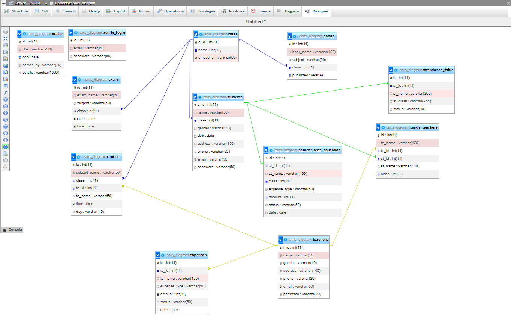
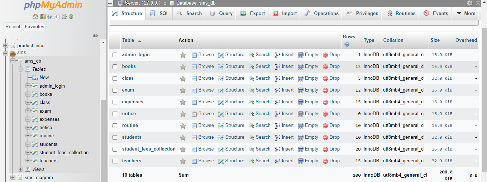

# This is a School Management System Application

## Live site link:
https://project.devmrahman.com/admin/

## Features:  
* admin / student / teacher - Login & sign up
* add / edit / delete - teacher & student
* add / edit / delete - Notice board
* student attendance
* Accounts Section - (Teacher's Salary & Student's fees )
* Attendance Module (in process)
* Routine Module
* Exam Module
* Class Module
* Books Module

## Technologies:  
* Html 5
* CSS 3
* Bootstrap 4
* PHP
* Mysql
* jquery

### Contributors:  
* [Mizanur Rahman](https://github.com/mizanur1326)
* [Masum Ahmed](https://github.com/masum-yasin)
* [Khayrul Alam](https://github.com/Rockrayhan)

#### database_informations:
* admin Email: abc@gmail.com
* admin Password: 123
* DB name: sms_db

## UI Diagram For Database

## Database Tables

#### contributions:
##### Mizanur Rahman
* Dashboard Customization
* Student & Teacher CRUD 
* Attendance ( in process )
* routine Module

##### Masum Hossain
* Login Module
* Implement Sessions 
* Notice Module
* Exam Module

##### Khayrul Alam
* Accounts Section
* class Module
* DB Diagram design 
* Books Modules ( in process )
* Documentation for Project
